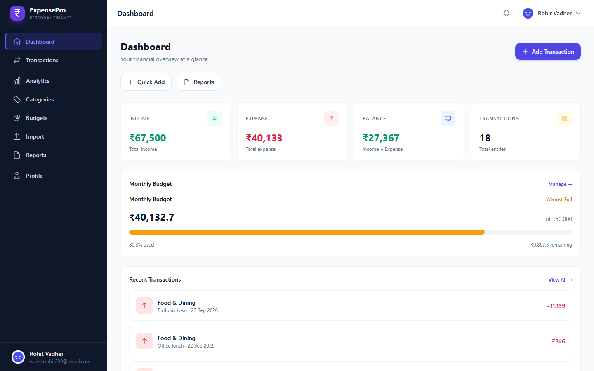
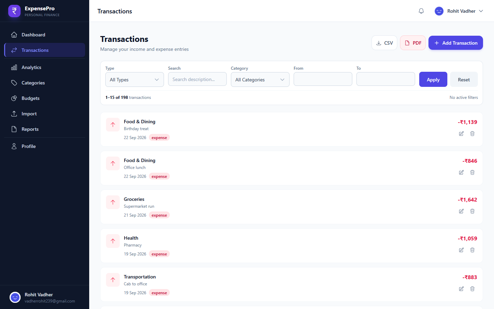
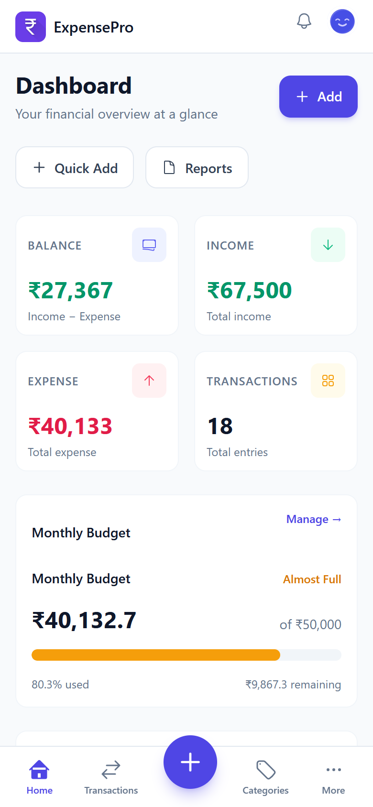
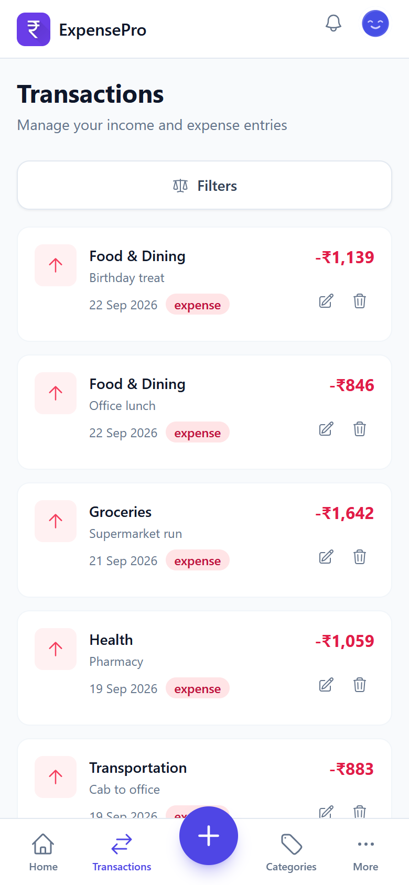
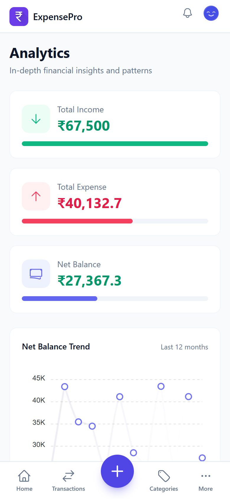

# ExpensePro

> **Personal finance management with a clean, focused interface — built with PHP, MySQL, vanilla JavaScript, and PWA support.**

[](https://www.php.net/)
[](https://www.mysql.com/)
[](https://developer.mozilla.org/en-US/docs/Web/JavaScript)
[](./manifest.json)
[](https://httpd.apache.org/)

ExpensePro is a PHP and MySQL personal finance application for managing income, expenses, categories, budgets, analytics, reports, notifications, quick templates, and financial imports/exports.

## Screenshots

### Desktop

<p align="center">
  
  
</p>

### Mobile

<p align="center">
  
  
  
</p>

More interface screenshots are available in [`docs/screenshots/`](./docs/screenshots/).

## Features

- Secure registration, login, logout, sessions, and remember-me authentication
- Dashboard with income, expenses, balance, activity, and budget status
- Transaction management with search, filters, pagination, create, edit, and delete
- Income and expense category management
- Weekly, monthly, and yearly budgets
- Financial analytics and category breakdowns
- Reports with date ranges, charts, CSV export, and PDF/print output
- CSV import with parsing, validation, duplicate detection, preview, and history
- Notifications with read/unread state
- Quick templates for frequent entries
- Profile management and password change
- Command palette and responsive mobile navigation
- Installable PWA with offline support for supported cached resources

## Theme

ExpensePro follows a light, minimal finance-oriented visual system:

- **Primary:** Indigo/purple accents for actions and focus states
- **Background:** Soft slate/near-white surfaces for a clean workspace
- **Text:** Deep slate tones for high readability
- **Success:** Green for positive financial states
- **Warning:** Amber for attention and budget states
- **Error:** Red/rose for destructive or invalid states
- **Components:** Rounded cards, restrained borders, compact controls, and clear spacing
- **Responsive UI:** Dedicated desktop and mobile layouts with safe-area support

The visual language is intentionally focused on clarity rather than decorative effects.

## Technology Stack

| Layer | Technology |
| --- | --- |
| Backend | PHP 8+ |
| Database | MySQL 8+ |
| Database Access | PDO |
| Storage Engine | InnoDB |
| Character Set | `utf8mb4` |
| Frontend | Vanilla JavaScript |
| Styling | Tailwind CSS + modular CSS |
| Charts | ApexCharts |
| Date Handling | Flatpickr + Day.js |
| PDF | html2pdf.js + server printable report |
| PWA | Service Worker + Web App Manifest |
| Web Server | Apache / XAMPP |

## Architecture

```text
                         ExpensePro
                             │
             ┌───────────────┴───────────────┐
             │                               │
         Presentation                     Backend
             │                               │
       pages / layouts                   API endpoints
             │                               │
       frontend modules                 services / rules
             │                               │
        API client                     repositories
             │                               │
             └───────────────┬───────────────┘
                             │
                            PDO
                             │
                           MySQL
```

### Request flow

```text
User
 ↓
UI Event
 ↓
Frontend Validation
 ↓
API Client
 ↓
PHP API
 ↓
Authentication / CSRF
 ↓
Backend Validation
 ↓
Service
 ↓
Repository
 ↓
PDO
 ↓
MySQL
 ↓
API Response
 ↓
Frontend State
 ↓
UI
```

## Project Structure

```text
ExpensePro/
│
├── api/
│   ├── budgets.php
│   ├── categories.php
│   ├── dashboard.php
│   ├── export.php
│   ├── import.php
│   ├── login.php
│   ├── logout.php
│   ├── notifications.php
│   ├── profile.php
│   ├── quick-templates.php
│   ├── register.php
│   ├── reports.php
│   ├── transactions.php
│   └── version.php
│
├── assets/
│   ├── css/
│   │   ├── core/            # Base, tokens, utilities
│   │   ├── layout/          # Desktop, mobile, responsive, print
│   │   ├── components/      # Forms, cards, buttons, modal, tables, toast
│   │   ├── features/        # Datepicker, PDF, PWA
│   │   ├── pages/           # Page-specific styles
│   │   └── tailwind.css
│   │
│   ├── js/
│   │   ├── core/            # API, config, errors, finance, form state, validation
│   │   ├── pages/           # Page controllers
│   │   ├── app.js           # Shared application coordination
│   │   ├── dashboard.js
│   │   ├── transactions.js
│   │   ├── categories.js
│   │   ├── charts.js
│   │   ├── pdf.js
│   │   ├── pwa.js
│   │   ├── vendor.js
│   │   └── loader.js
│   │
│   └── icons/               # Web/PWA and SVG icon assets
│
├── backend/
│   ├── calculations/        # Financial calculations
│   ├── core/                # Shared backend primitives
│   ├── database/
│   │   ├── repositories/    # Database access
│   │   └── TransactionManager.php
│   ├── domain/              # Domain-specific rules
│   ├── http/                # Response handling
│   ├── security/            # CSRF, device and rate limiting
│   ├── services/            # Business workflows
│   ├── support/             # Formatting and supporting utilities
│   └── validation/          # Server-side validation
│
├── database/
│   └── schema.sql           # MySQL schema and upgrade-safe definitions
│
├── docs/
│   ├── assets/              # Charts and diagrams
│   ├── charts/              # Architecture/project analytics
│   ├── diagrams/            # System, API, database, security, PWA flows
│   └── screenshots/         # Desktop and mobile UI screenshots
│
├── includes/
│   ├── api.php              # API bootstrap/helpers
│   ├── auth.php             # Authentication/session helpers
│   ├── config.php           # Application configuration
│   ├── database.php         # PDO connection bootstrap
│   ├── finance.php          # Finance compatibility layer
│   └── functions.php        # Shared compatibility loader
│
├── layouts/
│   ├── app-header.php
│   ├── guest-header.php
│   ├── sidebar.php
│   ├── mobile-bottom-nav.php
│   ├── footer.php
│   └── scripts.php
│
├── offline/
│   └── offline.html         # Offline fallback page
│
├── pages/
│   ├── home.php
│   ├── login.php
│   ├── register.php
│   ├── dashboard.php
│   ├── transactions.php
│   ├── categories.php
│   ├── budgets.php
│   ├── analytics.php
│   ├── reports.php
│   ├── import.php
│   ├── notifications.php
│   ├── profile.php
│   ├── help.php
│   └── 404.php
│
├── .htaccess
├── .gitignore
├── index.php
├── LICENSE
├── manifest.json
└── sw.js
```

## Frontend Structure

The frontend is modular rather than framework-dependent.

```text
Page
 │
 ├── Page Controller
 │
 ├── Core
 │   ├── API Client
 │   ├── Validation
 │   ├── Error Handler
 │   ├── Finance
 │   └── Form State
 │
 ├── Services / Feature Logic
 │
 └── UI Rendering
```

The shared frontend core centralizes API communication, response handling, validation, finance calculations, loading/error states, and reusable UI behavior.

## Backend Structure

The backend separates HTTP handling from business logic and database access.

```text
API Endpoint
    ↓
Authentication / CSRF
    ↓
Validation
    ↓
Service
    ↓
Repository
    ↓
PDO
    ↓
MySQL
```

Key responsibilities:

| Layer | Responsibility |
| --- | --- |
| `api/` | HTTP boundary and endpoint handling |
| `backend/services/` | Business workflows |
| `backend/database/repositories/` | MySQL data access |
| `backend/validation/` | Server-side validation |
| `backend/security/` | CSRF, rate limiting, device/session controls |
| `backend/calculations/` | Financial calculation logic |
| `backend/http/` | Structured API responses |
| `includes/` | Application bootstrap and compatibility loading |

## Database

ExpensePro uses MySQL with InnoDB and `utf8mb4`.

Core tables include:

- `users`
- `categories`
- `transactions`
- `budgets`
- `quick_templates`
- `csv_imports`
- `login_attempts`
- `rate_limits`
- `notifications`

Money is stored using exact `DECIMAL(12,2)` values.

Relationships are user-scoped, with foreign-key constraints and indexes for common authentication, filtering, reporting, and cleanup queries.

Schema:

[`database/schema.sql`](./database/schema.sql)

## Validation

Validation is applied at multiple layers:

```text
User Input
    ↓
Frontend Validation
    ↓
API Request
    ↓
Backend Validation
    ↓
Business Rules
    ↓
Database Constraints
    ↓
MySQL
```

Frontend validation provides immediate feedback while the backend remains authoritative.

Examples of validated data include:

- email
- passwords
- transaction type
- category ownership/type
- transaction amount
- dates
- names
- CSV rows
- duplicate records

## Security

ExpensePro includes:

- Password hashing with bcrypt
- Session regeneration
- Remember-me token rotation
- CSRF protection
- PDO prepared statements
- Input validation and output escaping
- Rate limiting
- Safe API error responses
- Security headers

Sensitive database credentials should be supplied through local configuration and never committed to the repository.

## Financial Calculations

The application keeps financial calculations consistent across dashboard, analytics, reports, budgets, exports, and profile statistics.

```text
Balance
= Total Income - Total Expense

Savings Rate
= ((Income - Expense) / Income) × 100

Budget Remaining
= max(0, Budget Limit - Spent)
```

## PWA

ExpensePro includes:

- Web App Manifest
- Service Worker
- Versioned caches
- Static-resource caching
- Navigation fallback
- Offline page
- Network-aware API behavior
- Cache cleanup
- Install/update support

The service worker is implemented in [`sw.js`](./sw.js).

## Import & Export

### CSV Import

```text
CSV File
 ↓
File Validation
 ↓
Header Detection
 ↓
Row Parsing
 ↓
Row Validation
 ↓
Duplicate Detection
 ↓
Database Transaction
 ↓
Import Result / History
```

### Export

ExpensePro supports CSV and printable/PDF report output using the application's existing server-authoritative data and filters.

## Performance

The project uses:

- Modular JavaScript
- Shared API communication
- Lazy vendor loading
- Cancellable requests
- Stale-response protection
- Event delegation
- Indexed MySQL queries
- Pagination
- Cached static resources
- Service-worker caching

## Installation

### Requirements

- Apache
- PHP 8.0+
- MySQL 8.0+

### XAMPP

1. Install XAMPP with Apache, PHP, and MySQL.
2. Copy the project into `C:\xampp\htdocs\ExpensePro`.
3. Start Apache and MySQL.
4. Create a database named `expensepro`.
5. Import [`database/schema.sql`](./database/schema.sql).
6. Open:

```text
http://localhost/ExpensePro/
```

### MySQL

```sql
CREATE DATABASE IF NOT EXISTS expensepro
  CHARACTER SET utf8mb4
  COLLATE utf8mb4_unicode_ci;
```

Use the project's supported configuration to provide the database connection values.

## Browser Support

ExpensePro targets modern browsers supporting:

- ES6+
- Fetch API
- modern CSS
- Service Workers
- responsive viewport features

Primary browsers:

- Chrome
- Edge
- Firefox
- Safari

## Author

**Rohit Vadher**

## License

See [`LICENSE`](./LICENSE) for the repository license.
